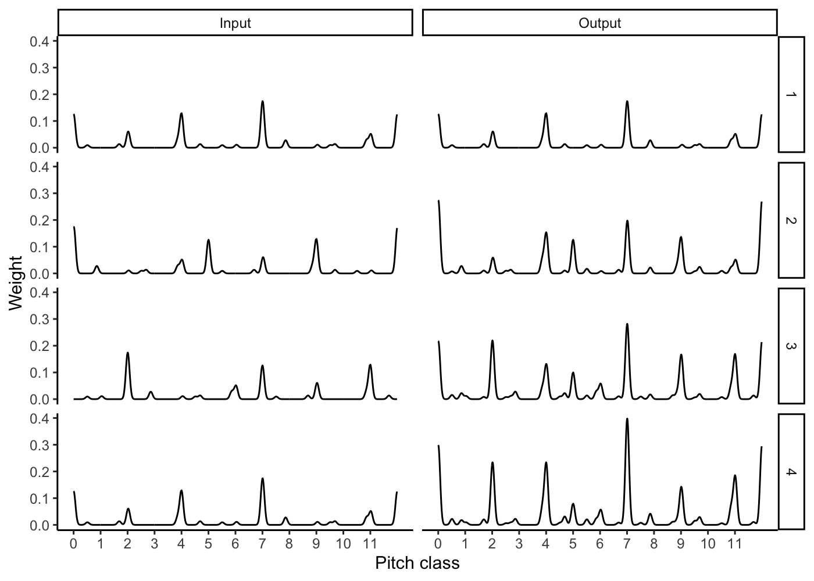

<!-- README.md is generated from README.Rmd. Please edit that file -->

# specdec

## Installation

From GitHub:

``` r
if (!require(devtools)) install.packages("devtools")
devtools::install_github("pmcharrison/specdec")
```

## Example

``` r
library(specdec)
library(ggplot2)

chords <- list(
  c(60, 64, 67),
  c(60, 65, 69),
  c(59, 62, 67),
  c(60, 64, 67)
) %>% 
  purrr::map(hrep::pi_chord) %>% 
  hrep::vec("pi_chord")

list(
  Input = hrep::represent(chords, "milne_pc_spectrum"),
  Output = spectral_decay(chords)
) %>% 
  purrr::map2_dfr(., names(.), function(vec, label) {
    purrr::map2_dfr(vec, seq_along(vec), function(chord, i) {
      cbind(
        as.data.frame(chord),
        pos = i,
        seq = label,
        stringsAsFactors = FALSE
      )
    })
  }) %>% 
  ggplot(aes(x, y)) +
  geom_line() + 
  facet_grid(pos ~ seq) +
  scale_x_continuous("Pitch class", breaks = 0:11) + 
  scale_y_continuous("Weight") +
  theme_classic()
```


